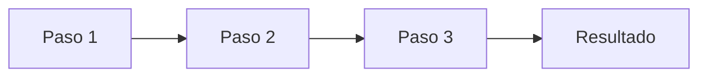

# Polish Transcriptions Skill

Transform raw, machine-generated transcriptions into polished, cognitively-ordered Obsidian notes that are both readable and complete.

## Objective

Convert poorly transcribed audio/video content (workshops, lectures, meetings, interviews) into well-structured, publication-ready documents while **preserving 100% of the original information**.

## Core Principles

### 1. Zero Information Loss

> [!danger] Critical Requirement
> Never omit, summarize, or compress information from the original. Every detail, example, tangent, question, and answer must be preserved. The output should contain MORE structure, not LESS content.

### 2. Cognitive Reorganization

Transform stream-of-consciousness speech into logical document sections:

| Speech Pattern            | Transforms To                  |
| ------------------------- | ------------------------------ |
| Topic jumping             | Grouped sections with headers  |
| Repetition                | Single consolidated statement  |
| Filler words/false starts | Clean prose                    |
| Tangents                  | Callouts or integrated context |
| Q&A interruptions         | Blockquote dialogues           |

### 3. Semantic Structure Over Chronological Order

Reorganize content by **meaning**, not by when things were said. A 2-hour rambling lecture about three topics becomes three clean sections, even if the speaker jumped between them.

---

## Transformation Process

### Phase 1: Analysis

Before writing anything:

1. **Read the entire transcript** — Understand all topics covered
2. **Identify main themes** — What are the 3-7 core topics?
3. **Categorize content types**:
   - Core instruction/information
   - Examples and anecdotes
   - Q&A interactions
   - Meta-commentary (jokes, digressions)
   - Action items or recommendations
4. **Map relationships** — Which topics depend on others?

### Phase 2: Structure Design

Create a logical outline:

```markdown
## [Main Topic 1]

### [Subtopic 1.1]

### [Subtopic 1.2]

---

## [Main Topic 2]

...
```

Use horizontal rules (`---`) to separate major topic shifts.

### Phase 3: Content Transformation

Apply these transformations systematically:

#### Headers and Hierarchy

```markdown
## Main Section <!-- H2 for major topics -->

### Subsection <!-- H3 for subtopics -->

#### Point or Example <!-- H4 for specific items when needed -->
```

#### Dialogues and Q&A

Preserve speaker identities with blockquotes:

```markdown
> **Participante:** ¿Cómo funciona X?
> **Instructor:** X funciona de esta manera...
```

For multi-turn exchanges:

```markdown
> **Estudiante:** Primera pregunta
> **Profesora:** Respuesta inicial
> **Estudiante:** Pregunta de seguimiento
> **Profesora:** Respuesta expandida
```

#### Callouts for Special Content

| Content Type          | Callout to Use                 |
| --------------------- | ------------------------------ |
| Key concept/principle | `> [!important]`               |
| Practical advice      | `> [!tip] Recomendación`       |
| Warning/caution       | `> [!warning]`                 |
| Interesting aside     | `> [!note]`                    |
| Real-world example    | `> [!example]`                 |
| Quoted wisdom         | `> [!quote]`                   |
| Action items          | `> [!todo]`                    |
| Summary               | `> [!abstract]` or `> [!tldr]` |
| Success/conclusion    | `> [!success]`                 |

#### Tables for Structured Data

Convert comparison discussions into tables:

```markdown
| Columna 1 | Columna 2 | Columna 3 |
| --------- | --------- | --------- |
| Dato 1    | Dato 2    | Dato 3    |
```

#### Lists for Enumerated Content

When the speaker lists things (even implicitly):

```markdown
- Item one
- Item two
  - Sub-item
- Item three
```

#### Mermaid Diagrams for Processes

When a process or flow is described:

````markdown

````

#### Code Blocks for Technical Content

````markdown
```python
# Example code from the presentation
def example():
    return "formatted code"
```
````

---

## Formatting Standards

### Frontmatter

Always include appropriate YAML frontmatter:

```yaml
---
date: YYYY-MM-DD
professor: "[[Speaker Name]]"
# or
speaker: "[[Speaker Name]]"
# optional
tags:
  - workshop
  - topic
---
```

### Text Formatting

| Purpose                 | Syntax       | Example               |
| ----------------------- | ------------ | --------------------- |
| Key terms first mention | `**bold**`   | **machine learning**  |
| Technical terms         | `` `code` `` | `SQL`                 |
| Emphasis                | `*italic*`   | _very_ important      |
| Highlighting            | `==text==`   | ==critical deadline== |

### Links

Create wikilinks for concepts that deserve their own notes:

```markdown
Esto se relaciona con [[machine learning]] y [[data science]].
```

---

## Anti-Patterns (What NOT To Do)

### ❌ Summarizing

```markdown
<!-- BAD: Lost information -->

El instructor habló sobre varios temas de datos.

<!-- GOOD: Preserves detail -->

El instructor cubrió tres áreas principales:

1. **Integración de datos** — consolidar información de múltiples fuentes
2. **Limpieza y transformación** — ordenar, depurar y preparar los datos
3. **Análisis exploratorio** — comprender patrones y comportamientos
```

### ❌ Removing "Unimportant" Content

```markdown
<!-- BAD: Removes color and context -->

(omitted anecdote about COVID impact)

<!-- GOOD: Preserves as callout -->

> [!example] Caso Real: El Impacto del COVID-19
> En un banco donde trabajé, teníamos modelos de predicción de mora...
```

### ❌ Flattening Dialogue

```markdown
<!-- BAD: Loses attribution -->

Se discutió que SQL es el lenguaje principal.

<!-- GOOD: Preserves interaction -->

> **Estudiante:** ¿Qué es SQL?
> **Profesora:** SQL es el lenguaje de programación de bases de datos.
```

### ❌ Over-Structuring

```markdown
<!-- BAD: Too many headers for simple content -->

#### Definición de Dato

##### Tipo 1

###### Subtipo A

<!-- GOOD: Appropriate nesting -->

### Tipos de Datos

- **Tipo 1:** Descripción
  - Subtipo A
```

---

## Quality Checklist

Before delivering the polished document:

- [ ] **Information complete** — All original content is present
- [ ] **Logical structure** — Grouped by topic, not chronology
- [ ] **Frontmatter present** — Date, speaker/professor, optional tags
- [ ] **Headers used correctly** — H2 for sections, H3 for subsections
- [ ] **Dialogues preserved** — Q&A in blockquote format with speaker names
- [ ] **Callouts appropriate** — Important points in `[!tip]`, `[!important]`, etc.
- [ ] **Tables where helpful** — Comparisons and structured data formatted
- [ ] **Mermaid diagrams** — Processes visualized when described
- [ ] **Bold for key terms** — First mention of important concepts
- [ ] **Wikilinks created** — Concepts linked with `[[concept]]`
- [ ] **Horizontal rules** — Major topic separations marked with `---`
- [ ] **Clean prose** — No filler words, false starts, or transcription artifacts
- [ ] **No orphan headers** — Every header has content below it

---

## Example Transformation

### Before (Raw Transcription)

```
bueno entonces ehh vamos a ver lo de las bases de datos entonces
una base de datos es pues como un lugar donde guardas cosas no?
ah esperen me olvidé de decirles mi nombre soy Carmen ehh entonces
como les decía hay diferentes tipos de bases de datos algunas son
relacionales otras no relacionales las relacionales usan SQL que es
un lenguaje de programación bueno no exactamente programación pero
sirve para consultar datos entonces SQL significa structured query
language y sirve para hacer consultas a la base de datos...
```

### After (Polished Document)

```markdown
---
date: 2025-08-08
professor: "[[Carmen Marín]]"
---

## Introducción a las Bases de Datos

Una **base de datos** es un almacén centralizado donde se guardan
y organizan datos para su posterior acceso y manipulación.

### Tipos de Bases de Datos

| Tipo              | Características                 |
| ----------------- | ------------------------------- |
| **Relacional**    | Utiliza SQL, estructura tabular |
| **No relacional** | NoSQL, estructuras flexibles    |

### SQL (Structured Query Language)

**SQL** es el lenguaje estándar para interactuar con bases de datos
relacionales. Permite realizar consultas, inserciones, actualizaciones
y eliminaciones de datos.

> [!note] Aclaración
> Aunque SQL contiene elementos de programación, técnicamente es un
> lenguaje de consulta, no un lenguaje de programación de propósito general.
```

---

## Workflow Integration

### Suggested Process

1. **Read** the obsidian-markdown skill first for syntax reference
2. **Analyze** the complete raw transcript
3. **Outline** the logical structure
4. **Transform** section by section
5. **Review** against the quality checklist
6. **Verify** no information was lost by comparing key facts

### Output Location

Polish transcriptions should be saved to the appropriate location in the user's vault, typically:

- `03 resources/` for workshops and external content
- `01 projects/.../classes/` for academic lectures
- Same directory as source with a new filename

---

## Success Criteria

A successfully polished transcription:

1. **Reads like a well-written article** — Not like speech
2. **Contains all original information** — Nothing omitted
3. **Uses Obsidian features effectively** — Callouts, tables, diagrams
4. **Has clear cognitive structure** — Easy to navigate and reference
5. **Preserves speaker personality** — Quotes and dialogues maintain voice
6. **Is immediately usable** — No further editing needed by user

---

## References

- [Obsidian Callouts Documentation](https://help.obsidian.md/callouts)
- [Obsidian Properties and Frontmatter](https://help.obsidian.md/properties)
- [Mermaid Diagram Syntax](https://mermaid.js.org/intro/)
- [CommonMark Specification](https://commonmark.org/)
